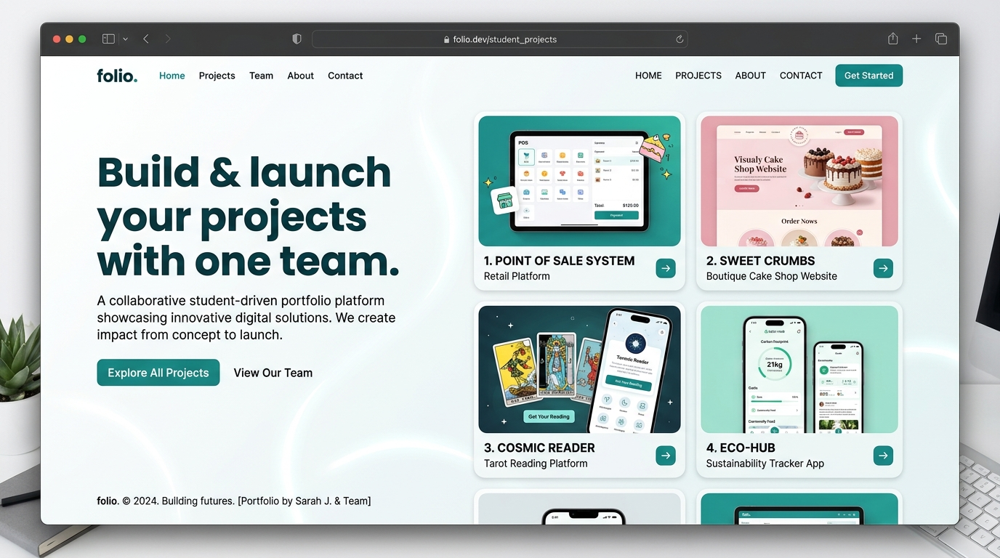

# 🌐 Student Portfolio — ThreePoints



## 📋 Project Description

A personal portfolio website created as part of the **Software Engineering** course at **UNIMY** (University Malaysia of Computer Science & Engineering). This project demonstrates basic web development skills and GitHub usage including commits, branches, issues, and pull requests.

## 👥 Team Members

| Name | Role |
|---|---|
| **Min Zayar Khant** | Full-Stack Developer |
| **Chan Nyein Thant** | Frontend Developer |
| **Khant Wai Yan Kyaw** | Backend Developer |

## ✨ Features

- **Home / Introduction** — Welcome section with animated counters and gradient effects
- **About Us** — Team member profiles with role descriptions
- **Skills** — Animated skill bars showing our technology stack
- **Education** — Timeline of our academic journey
- **Project Showcase** — 4 real-world deployed projects with live links
- **Contact Information** — Email, phone, Telegram, TikTok, Facebook, Instagram
- **Dark Mode** — Toggle between light and dark themes
- **Responsive Design** — Works on desktop, tablet, and mobile
- **Smooth Animations** — Scroll-reveal effects, hover interactions, animated counters

## 🚀 Projects Showcased

| Project | Description | Link |
|---|---|---|
| **NexaMint POS** | Point of Sale system for Myanmar retail shops | [pos.threepoints.tech](https://pos.threepoints.tech) |
| **Cake4U** | Online cake ordering platform | [cake4u.nexamint.tech](https://cake4u.nexamint.tech) |
| **NexaWrite** | Myanmar AI content writing studio | [write.nexamint.tech](https://write.nexamint.tech) |
| **AstroMint Tarot** | Burmese tarot card reading app | [tarot.nexamint.tech](https://tarot.nexamint.tech) |

## 🛠️ Technologies Used

- HTML5
- CSS3 (Custom Properties, Flexbox, Grid, Animations)
- JavaScript (Intersection Observer, DOM manipulation)
- Google Fonts (Inter)
- Git & GitHub

## 📂 File Structure

```
student-portfolio/
├── index.html          # Main portfolio page
├── style.css           # All styling and design system
├── script.js           # Dark mode, animations, interactivity
├── README.md           # This file
└── images/
    ├── pos-preview.jpg
    ├── cake4u-preview.jpg
    ├── nexawrite-preview.jpg
    └── tarot-preview.jpg
```

## ▶️ How to Run

1. Clone this repository:
   ```bash
   git clone https://github.com/zeus153790/TestForProject.git
   ```
2. Open `index.html` in any web browser.
3. Or visit the live deployed link: `https://TestForProject.vercel.app` (or Vercel link)

## 📝 GitHub Usage

This project demonstrates the following GitHub features:
- ✅ **8+ commits** with meaningful messages
- ✅ **2 branches** — `main` and `feature-design`
- ✅ **2 issues** — tracked with labels
- ✅ **1 pull request** — merged into main
- ✅ **README** — comprehensive project documentation

## 👨‍💻 Authors

- **Min Zayar Khant** — First Year CS Student, UNIMY
- **Chan Nyein Thant** — First Year CS Student, UNIMY
- **Khant Wai Yan Kyaw** — First Year CS Student, UNIMY

## 📞 Contact

- 📧 Email: threepoints@gmail.com
- 📱 Phone: 09978772558
- ✈️ Telegram: [@Terror_come](https://t.me/Terror_come)
- 🎵 TikTok: @ThreePoints
- 📘 Facebook: ThreePoints
- 📸 Instagram: @ThreePoints

---

*Built with ❤️ for Software Engineering course at UNIMY — 2025*

## 🔮 Future Roadmap

- Integrate a contact message form sending emails directly.
- Add more advanced animations and interactive CSS transitions.
- Expand the portfolio with individual case studies for each project.


## 🔮 Future Roadmap

- Integrate a contact message form sending emails directly.
- Add more advanced animations and interactive CSS transitions.
- Expand the portfolio with individual case studies for each project.

